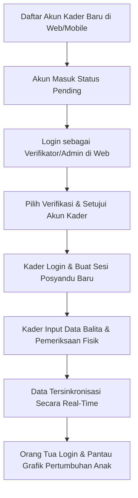

# 🏥 Buku Panduan Utama POSCO (Sistem Informasi Terintegrasi Posyandu & Tumbuh Kembang)

Selamat datang di Buku Panduan Utama **POSCO**! POSCO adalah sebuah platform terintegrasi yang dirancang untuk membantu pemantauan kesehatan balita dan ibu hamil di posyandu secara digital, cepat, dan akurat. Sistem ini terdiri dari dua komponen utama:
1. **Portal Web (React + Vite)**: Digunakan oleh **Admin**, **Verifikator**, **Kader**, dan **Orang Tua**.
2. **Aplikasi Mobile (Flutter)**: Khusus dirancang untuk memberikan kemudahan akses bagi **Kader** dan **Orang Tua** di lapangan.

Dokumentasi ini dibagi menjadi beberapa modul panduan berdasarkan hak akses (Role) pengguna untuk memudahkan navigasi pemahaman alur aplikasi.

---

## 📂 Daftar Buku Panduan Pengguna

Untuk mulai membaca panduan spesifik tiap peran, silakan klik tautan di bawah ini:

| Peran (Role) | Media Akses | Tautan Buku Panduan | Deskripsi Fokus |
| :--- | :--- | :--- | :--- |
| **Administrator & Verifikator** | Portal Web | 📘 [PANDUAN_ADMIN.md](file:///c:/Kuliah/Semester%206/Proyek%20Integrasi%20Sistem/posco%20webv2/projek-posco/PANDUAN_ADMIN.md) | Mengelola data posyandu, wilayah, akun pengguna, verifikasi kader baru, serta laporan analitis stunting global. |
| **Kader Posyandu** | Web & Mobile | 📗 [PANDUAN_KADER.md](file:///c:/Kuliah/Semester%206/Proyek%20Integrasi%20Sistem/posco%20webv2/projek-posco/PANDUAN_KADER.md) | Pencatatan data balita/ibu hamil, input berkala antropometri (BB, TB, LILA), pembuatan sesi jadwal posyandu, rujukan, serta unduh PDF laporan warga. |
| **Orang Tua / Wali** | Web & Mobile | 📙 [PANDUAN_ORANG_TUA.md](file:///c:/Kuliah/Semester%206/Proyek%20Integrasi%20Sistem/posco%20webv2/projek-posco/PANDUAN_ORANG_TUA.md) | Memantau grafik tumbuh kembang anak, melihat riwayat imunisasi & posyandu, mengunduh laporan PDF, edit profil secara real-time, serta akses Pusat Bantuan (FAQ). |

---

## 🔑 Alur Pendaftaran (Registrasi) & Autentikasi Umum

Sebelum dapat memanfaatkan fitur-fitur di dalam aplikasi POSCO, pengguna harus melewati gerbang keamanan autentikasi terlebih dahulu. Berikut penjelasan detail alurnya:

### 1. Registrasi Akun Baru (Kader & Orang Tua)
Registrasi dilakukan melalui Portal Web maupun Aplikasi Mobile dengan langkah sebagai berikut:
1. Buka halaman registrasi melalui [Register.jsx](file:///c:/Kuliah/Semester%206/Proyek%20Integrasi%20Sistem/posco%20webv2/projek-posco/web/src/pages/Register.jsx) di web atau melalui form registrasi di aplikasi mobile.
2. **Pilih Peran Akun**: Pilih antara **Kader** atau **Orang Tua**.
3. **Isi Formulir Identitas**:
   - **Nama Lengkap**: Nama asli pengguna.
   - **Email**: Alamat email aktif (digunakan sebagai ID Login).
   - **Nomor Induk Kependudukan (NIK)**: 16 digit NIK.
   - **Nomor Telepon**: Nomor HP aktif yang dapat dihubungi.
   - **Kata Sandi (Password)**: Minimal terdiri dari 8 karakter keamanan.
   - **Wilayah / Posyandu**: Pilih lokasi tugas bagi Kader, atau posyandu terdekat bagi Orang Tua.
4. Klik tombol **Daftar Sekarang**.

> [!WARNING]
> **Persetujuan Akun Kader (Pending Verification)**:
> Pendaftaran akun dengan peran **Kader** tidak akan langsung aktif setelah menekan tombol daftar. Akun tersebut akan masuk ke dalam daftar verifikasi dengan status `kader_pending`. Akses masuk akan ditangguhkan hingga **Verifikator** menyetujui akun tersebut. Orang Tua, sebaliknya, dapat langsung masuk setelah pendaftaran berhasil.

### 2. Alur Masuk (Login) Sistem
Sistem POSCO membedakan gerbang masuk portal web menjadi dua untuk menjaga kerahasiaan hak akses:
*   **Gerbang Login Umum (Kader & Orang Tua)**: Diakses melalui [Login.jsx](file:///c:/Kuliah/Semester%206/Proyek%20Integrasi%20Sistem/posco%20webv2/projek-posco/web/src/pages/Login.jsx). Pengguna memilih peran, memasukkan Email dan Password, lalu sistem memvalidasi sesi.
*   **Gerbang Login Administrator**: Diakses secara aman melalui [AdminLogin.jsx](file:///c:/Kuliah/Semester%206/Proyek%20Integrasi%20Sistem/posco%20webv2/projek-posco/web/src/pages/AdminLogin.jsx).
*   **Aplikasi Mobile**: Menggunakan token JWT via [api_client.dart](file:///c:/Kuliah/Semester%206/Proyek%20Integrasi%20Sistem/posco%20webv2/projek-posco/posco_app/posco_app/lib/shared/api_client.dart) untuk menyimpan sesi di `SharedPreferences` (Persistent Login). Pengguna tidak perlu mengetik kredensial login berulang kali saat membuka aplikasi di masa mendatang.

---

## 🎨 Kode Warna Status Gizi Standardisasi POSCO

Untuk menyeragamkan indikasi visual di seluruh portal web dan aplikasi mobile, POSCO menerapkan standarisasi warna status gizi sebagai berikut:

| Indikator Warna | Status Gizi | Makna & Tindakan Medis |
| :---: | :--- | :--- |
| 🟢 **Hijau** | **Normal** | Kondisi pertumbuhan anak berjalan sangat baik sesuai usia. Pertahankan pola makan. |
| 🟡 **Kuning / Oranye** | **Gizi Kurang / Berisiko** | Berat badan atau tinggi badan di bawah kurva standar. Membutuhkan perhatian nutrisi ekstra dari Kader & Orang Tua. |
| 🔴 **Merah** | **Gizi Buruk / Stunting** | Kondisi darurat di mana balita mengalami hambatan pertumbuhan kronis. Membutuhkan rujukan segera ke Puskesmas. |

---

## ⚙️ Petunjuk Pengujian Sistem (Ujicoba End-to-End)

Bagi pengembang atau staf posyandu yang ingin menguji alur aplikasi dari awal sampai akhir, ikuti skenario uji coba berikut:

### Langkah Uji Coba:
1.  **Registrasi Kader Baru**: Masuk ke [Register.jsx](file:///c:/Kuliah/Semester%206/Proyek%20Integrasi%20Sistem/posco%20webv2/projek-posco/web/src/pages/Register.jsx) dan daftarkan akun bertipe Kader.
2.  **Verifikasi Akun**: Logout, lalu masuk ke `/verifikator` atau login sebagai Admin. Buka tab **Menunggu Verifikasi** lalu klik **Setujui Kader** pada akun yang baru didaftarkan.
3.  **Memulai Sesi Posyandu**: Login kembali menggunakan akun Kader yang baru disetujui. Buat sesi posyandu baru di menu **Buat Sesi Baru**.
4.  **Pencatatan Balita**: Daftarkan balita baru, masukkan riwayat pemeriksaan antropometri di bawah menu **Tindak Lanjut** -> tab **Data Balita** -> tombol **Pemeriksaan**.
5.  **Pemantauan Orang Tua**: Daftarkan akun Orang Tua, lalu masuk ke dasbor. Verifikasi bahwa data grafik pertumbuhan di dasbor Orang Tua telah otomatis ter-update mengikuti input kader sebelumnya secara real-time.

---

*Panduan ini disusun sebagai acuan pengoperasian platform POSCO versi 2.0.0. Silakan hubungi admin wilayah jika terjadi kendala teknis atau kegagalan koneksi basis data.*
