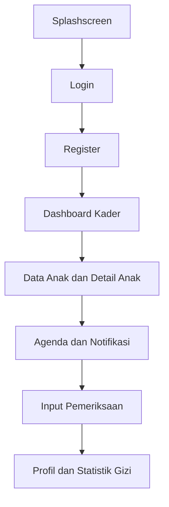
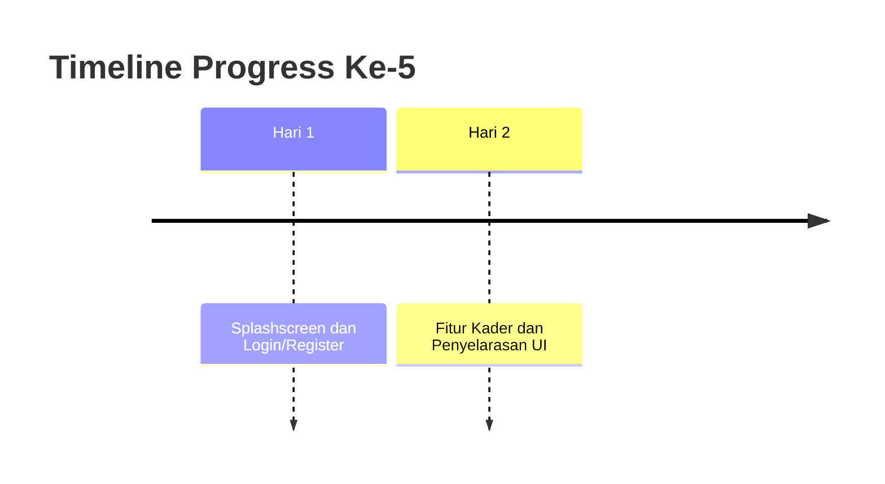
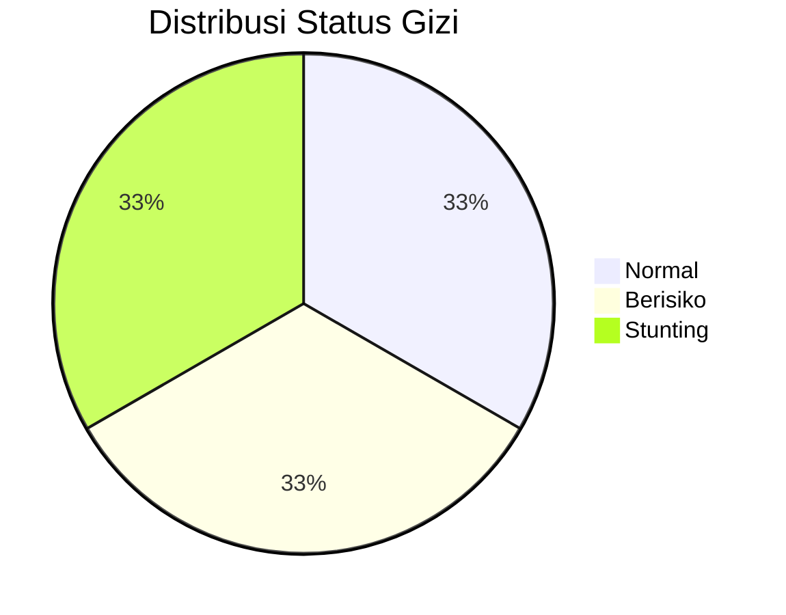

# LAPORAN PROGRESS 5

BAB I
PENDAHULUAN

1.1 Latar Belakang
Pengembangan aplikasi Posco pada sisi mobile bertujuan menyediakan antarmuka yang jelas, konsisten, dan mudah digunakan oleh kader posyandu. Kebutuhan ini muncul karena kader harus mencatat data anak, memeriksa status gizi, dan memantau agenda secara cepat. Jika tampilan tidak jelas, kader akan membutuhkan waktu lebih lama untuk memahami informasi, sehingga alur kerja menjadi kurang efisien. Oleh karena itu, fokus pengembangan frontend mobile diarahkan pada keterbacaan informasi, konsistensi warna status, dan kejelasan komponen kartu.

Progress ke-5 ini berfokus pada pembuatan frontend mobile dari awal, dimulai dari splashscreen sebagai gerbang pengalaman pengguna. Setelah splashscreen, alur autentikasi disiapkan melalui halaman login dan register. Selanjutnya, seluruh fitur pada role user kader dikerjakan agar aplikasi memiliki end-to-end flow yang utuh. Dengan kata lain, progress ini bukan hanya perbaikan minor, tetapi penyusunan lengkap frontend mobile untuk kebutuhan kader.

Selain itu, data dummy digunakan untuk mensimulasikan kondisi lapangan di lokasi Padang Utara dan Kelurahan Air Tawar. Data tersebut membantu tampilan terlihat realistis dan memungkinkan evaluasi visual sebelum data nyata tersedia. Dengan data dummy yang konsisten, aplikasi dapat dipresentasikan secara utuh, mulai dari login hingga pelaporan status gizi.

1.1.1 Konteks Operasional Kader
Kader posyandu bekerja dalam kondisi lapangan yang membutuhkan informasi ringkas dan cepat. Aplikasi harus memudahkan akses ke data anak, riwayat pemeriksaan, dan agenda layanan. Karena itu, desain antarmuka harus menonjolkan informasi inti, seperti status gizi dan pengukuran, menggunakan indikator visual yang konsisten.

1.1.2 Permasalahan yang Diatasi
Pada tahap awal, terdapat dua tantangan utama: pertama, belum adanya alur frontend mobile yang utuh dari splashscreen hingga fitur kader; kedua, beberapa elemen visual masih terlihat menyatu karena pemilihan warna yang terlalu lembut. Progress ini mengatasi kedua hal tersebut dengan membangun alur lengkap dan menyesuaikan kontras tampilan.

1.1.3 Arah Pengembangan Mobile
Arah pengembangan mobile pada progress ini menekankan konsistensi tampilan, kejelasan status gizi, dan kemudahan navigasi. Dengan demikian, aplikasi dapat langsung diuji oleh pengguna internal, serta menjadi fondasi untuk integrasi backend di tahap berikutnya.

1.2 Tujuan Progress
Tujuan utama progress ini adalah menyelesaikan frontend mobile dari awal hingga seluruh fitur kader dapat diakses. Tujuan tersebut dijabarkan menjadi beberapa poin:
1) Membuat alur splashscreen, login, dan register sebagai pintu masuk aplikasi.
2) Membangun seluruh fitur pada role kader, termasuk data anak, detail anak, agenda, input pemeriksaan, profil, notifikasi, statistik gizi, serta halaman tambah data.
3) Menyatukan data dummy agar konsisten pada semua halaman.
4) Menegaskan warna status gizi: hijau untuk Normal, oranye untuk Berisiko, merah untuk Stunting.
5) Memperbaiki kontras latar dan kartu agar setiap komponen terlihat jelas.

1.2.1 Target Output
Target output progress ini adalah aplikasi mobile yang siap diuji dari awal hingga akhir, dengan alur lengkap splashscreen, autentikasi, dan fitur kader. Output ini diharapkan cukup representatif untuk demo internal dan presentasi capaian progress.

1.2.2 Indikator Keberhasilan
Indikator keberhasilan progress ke-5 meliputi:
1) Alur splashscreen, login, dan register berjalan dengan lancar.
2) Semua halaman role kader dapat diakses dan berfungsi secara visual.
3) Status gizi memiliki warna konsisten di semua layar.
4) Data dummy konsisten pada daftar anak, detail anak, dan riwayat pemeriksaan.
5) Tidak ada komponen kartu yang menyatu dengan latar.

1.3 Ruang Lingkup
Ruang lingkup progress ini mencakup seluruh frontend mobile untuk role user kader. Fokus pekerjaan meliputi:
1) Splashscreen sebagai halaman awal aplikasi.
2) Login dan Register sebagai alur autentikasi.
3) Dashboard kader, Data Anak, Detail Anak, Agenda, Input Pemeriksaan, Profil, Statistik Gizi, dan Notifikasi.
4) Halaman pendukung: Tambah Anak, Tambah Agenda, dan Form Input Pemeriksaan.
5) Penyesuaian data dummy agar konsisten di seluruh halaman.

Progress ini belum mencakup backend, sinkronisasi data, maupun logika autentikasi nyata. Semua informasi masih berbasis dummy agar frontend dapat dievaluasi secara visual.

1.3.1 Batasan Teknis
Karena fokus berada pada frontend, aspek seperti manajemen state global, optimasi performa, dan integrasi API belum menjadi prioritas. Pendekatan ini dipilih agar desain dan alur pengguna dapat matang terlebih dahulu.

1.3.2 Asumsi Dasar
Diasumsikan bahwa user utama adalah kader posyandu yang membutuhkan informasi ringkas. Asumsi ini mempengaruhi pemilihan teks, ukuran font, warna, serta susunan komponen di tiap halaman.

1.4 Manfaat Kegiatan
Manfaat progress ini mencakup sisi pengguna, tim pengembang, dan kebutuhan dokumentasi. Untuk pengguna, aplikasi menjadi lebih jelas dan mudah dipahami. Untuk pengembang, konsistensi data dummy memudahkan pengujian. Untuk dokumentasi, aplikasi terlihat siap untuk demo.

Manfaat tersebut dapat dirinci sebagai berikut:
1) Kader dapat memahami status gizi dengan cepat melalui indikator warna.
2) Alur aplikasi lebih jelas mulai dari splashscreen hingga fitur kader.
3) Data dummy konsisten membuat tampilan lebih realistis.
4) Dokumentasi lebih kuat karena visual aplikasi sudah lengkap.
5) Aplikasi siap menjadi dasar integrasi backend selanjutnya.

1.4.1 Manfaat Teknis
Progress ini menghasilkan struktur tampilan yang konsisten, sehingga penambahan fitur berikutnya dapat dilakukan lebih cepat. Selain itu, basis UI yang rapi akan mempermudah refactor ketika data real sudah tersedia.

1.4.2 Manfaat Organisasi
Hasil progress ini memberikan bukti kerja yang lengkap dalam bentuk aplikasi mobile yang utuh. Hal ini bermanfaat untuk presentasi tim dan laporan akademik.

1.5 Sistematika Laporan
Laporan ini disusun dengan struktur: Bab I Pendahuluan, Bab II Progress Pengembangan, Bab III Rencana Selanjutnya, Bab IV Penutup, dan Lampiran.

1.5.1 Gaya Penulisan
Laporan ditulis secara naratif-deskriptif dengan subbab rinci untuk menjelaskan proses pengembangan frontend mobile secara menyeluruh.

1.5.2 Petunjuk Pembacaan
Pembaca dianjurkan mengikuti alur bab secara berurutan. Diagram mermaid disisipkan sebagai pendukung visual proses dan distribusi data.

BAB II
PROGRESS PENGEMBANGAN

2.1 Deskripsi Kegiatan
Progress ke-5 dilakukan selama dua hari terakhir dengan fokus pada pembuatan frontend mobile dari awal hingga seluruh fitur kader dapat digunakan. Pekerjaan dimulai dari splashscreen sebagai tampilan pembuka aplikasi. Setelah itu, dibuat halaman login dan register agar alur autentikasi tersedia meskipun masih berbasis dummy. Tahap berikutnya adalah membangun semua fitur pada role kader, dimulai dari dashboard, data anak, detail anak, agenda, input pemeriksaan, profil, statistik gizi, dan notifikasi.

Selama pengembangan, dilakukan evaluasi visual untuk memastikan konsistensi gaya antarmuka. Dari evaluasi tersebut, ditemukan bahwa beberapa kartu informasi terlalu mirip dengan latar, sehingga kurang terlihat. Selain itu, status gizi harus ditampilkan dengan warna konsisten agar pengguna langsung memahami kategori. Data dummy diseragamkan agar setiap halaman menunjukkan informasi yang sama terkait anak, lokasi, dan jadwal pemeriksaan.

Setelah tampilan inti terbentuk, dilakukan pengayaan pada detail pemeriksaan agar bersifat dinamis. Detail pemeriksaan menampilkan status, pengukuran, catatan, serta layanan sesuai riwayat yang dipilih. Statistik gizi juga ditambahkan agar aplikasi menampilkan ringkasan kondisi anak. Semua langkah ini memastikan frontend mobile tampil lengkap dan siap untuk diuji.

2.1.1 Pembangunan Splashscreen
Splashscreen dibuat sebagai identitas awal aplikasi. Hal ini penting untuk memberikan kesan profesional dan menjembatani pengguna menuju alur login. Desain splashscreen dibuat sederhana dan bersih agar tidak mengganggu, tetapi tetap mencerminkan identitas aplikasi.

2.1.2 Pembuatan Login dan Register
Login dan register disiapkan sebagai pintu masuk aplikasi. Form yang disediakan mencakup input dasar serta tampilan konsisten dengan tema aplikasi. Meskipun autentikasi masih dummy, halaman ini menunjukkan alur awal yang utuh.

2.1.3 Pengembangan Fitur Role Kader
Fitur kader mencakup dashboard, data anak, detail anak, agenda, input pemeriksaan, profil, statistik gizi, dan notifikasi. Seluruh fitur dibuat dengan struktur visual yang seragam agar pengalaman pengguna tetap konsisten.

2.1.4 Konsistensi Data Dummy
Data anak (Rani, Bayu, Cantika) disesuaikan dengan status gizi berbeda. Lokasi Padang Utara dan Kelurahan Air Tawar diterapkan di berbagai halaman. Jadwal pemeriksaan ditetapkan pada April dan Mei 2026 agar konsisten.

2.1.5 Penyesuaian Status Gizi
Status gizi ditampilkan dengan warna konsisten: hijau untuk Normal, oranye untuk Berisiko, merah untuk Stunting. Penyesuaian ini diterapkan pada seluruh halaman yang menampilkan status agar tidak terjadi perbedaan warna.

2.1.6 Pengujian Visual dan Navigasi
Setelah perubahan diterapkan, dilakukan uji navigasi antar halaman melalui hot reload. Tujuannya memastikan setiap halaman tampil rapi, transisi berjalan, dan tidak ada error saat berpindah layar.

Diagram 1. Alur Pembuatan Frontend Mobile
Letakkan diagram ini setelah subbab 2.1.6 untuk menggambarkan urutan pekerjaan.

2.2 Hasil Kegiatan
Hasil utama progress ke-5 adalah terbentuknya frontend mobile lengkap untuk role kader, mulai dari splashscreen hingga fitur pendukung. Dengan hasil ini, aplikasi dapat diuji secara end-to-end meskipun data masih dummy.

2.2.1 Alur Awal Aplikasi
Splashscreen, login, dan register sudah tersedia sehingga alur awal aplikasi tampak utuh. Hal ini memberi kesan profesional dan memungkinkan demo dimulai dari awal.

2.2.2 Fitur Kader Terbangun
Fitur-fitur kader berhasil dibuat: dashboard, data anak, detail anak, agenda, input pemeriksaan, profil, statistik gizi, dan notifikasi. Semua halaman memiliki tema yang konsisten.

2.2.3 Data Dummy Konsisten
Data anak dan lokasi sudah konsisten pada seluruh halaman. Status gizi berbeda untuk tiap anak sesuai skenario, sehingga riwayat pemeriksaan dan detail anak tampak realistis.

2.2.4 Visual Status Gizi Konsisten
Status gizi menampilkan warna yang seragam di semua halaman. Perubahan ini meningkatkan keterbacaan dan mengurangi kebingungan.

2.2.5 Kontras Kartu dan Latar
Latar beberapa halaman disesuaikan menjadi putih agar kartu berwarna hijau lembut terlihat jelas. Hal ini membuat form input lebih mudah dibaca.

2.2.6 Statistik Gizi Tersedia
Statistik gizi menampilkan jumlah anak pada setiap kategori. Meskipun sederhana, fitur ini memberi gambaran ringkas tentang kondisi anak.

2.3 Ringkasan Progress Minggu Ini
Ringkasan progress minggu ini mencakup:
1) Pembuatan alur awal aplikasi: splashscreen, login, dan register.
2) Pengembangan fitur lengkap pada role kader.
3) Konsistensi data dummy dan status gizi.
4) Penyesuaian visual agar kartu tidak menyatu dengan latar.

2.3.1 Ringkasan Per Halaman
1) Splashscreen: halaman pembuka aplikasi.
2) Login/Register: alur autentikasi dummy.
3) Dashboard: ringkasan aktivitas kader.
4) Data Anak dan Detail Anak: menampilkan data dan status gizi.
5) Agenda dan Notifikasi: daftar jadwal dan pengingat.
6) Input Pemeriksaan: form pengukuran dan catatan.
7) Profil dan Statistik Gizi: data kader dan ringkasan status.

Diagram 2. Timeline Progress Ke-5
Letakkan diagram ini setelah subbab 2.3.1.

2.4 Kendala dan Solusi
Kendala yang ditemui selama progress ke-5 dan solusi yang diterapkan adalah sebagai berikut:

2.4.1 Kendala Kontras Kartu
Beberapa kartu terlihat menyatu dengan latar. Solusi: ubah latar halaman menjadi putih agar kartu lebih jelas.

2.4.2 Kendala Konsistensi Status Gizi
Status gizi sempat tampil seragam. Solusi: perbarui data dummy agar tiap anak memiliki status berbeda.

2.4.3 Kendala Error Hot Reload
Perubahan parameter pada detail pemeriksaan sempat memicu error hot reload. Solusi: gunakan fallback nilai nullable dan lakukan hot reload ulang.

2.4.4 Kendala Konsistensi Data Dummy
Perbedaan nama orang tua sempat muncul. Solusi: samakan data dummy di semua halaman.

2.4.5 Kendala Kejelasan Statistik
Statistik gizi awalnya kurang informatif. Solusi: tampilkan jumlah anak per kategori.

Diagram 3. Distribusi Status Gizi Dummy
Letakkan diagram ini setelah subbab 2.4.5.

BAB III
RENCANA SELANJUTNYA

3.1 Rencana Kegiatan
Rencana kegiatan selanjutnya meliputi:
1) Membangun semua fitur untuk role user orang tua secara end-to-end.
2) Menyempurnakan login dan register agar menggunakan data asli, bukan dummy.
3) Menambahkan validasi form dan alur autentikasi yang lebih realistis.
4) Menyiapkan struktur data agar mudah diintegrasikan dengan backend.
5) Menyusun komponen reusable agar konsistensi UI tetap terjaga.

3.1.1 Prioritas Jangka Pendek
Fokus jangka pendek adalah membangun fitur role orang tua dan menyiapkan autentikasi dengan data asli.

3.1.2 Prioritas Jangka Menengah
Fokus jangka menengah adalah penguatan validasi, integrasi backend, dan penyelarasan data lintas peran.

3.2 Strategi Pelaksanaan
Strategi pelaksanaan meliputi iterasi cepat dengan hot reload, pengujian manual di setiap halaman, dan dokumentasi berkala melalui screenshot.

3.2.1 Strategi Uji Coba
Setiap perubahan diuji melalui navigasi antar halaman agar tidak ada error transisi.

3.2.2 Strategi Dokumentasi
Dokumentasi dilakukan untuk setiap halaman utama agar hasil kerja dapat ditunjukkan secara jelas pada laporan.

BAB IV
PENUTUP

4.1 Kesimpulan
Progress ke-5 berhasil membangun frontend mobile dari awal hingga fitur lengkap role kader. Alur splashscreen, login, register, dan seluruh fitur kader sudah tersedia. Data dummy konsisten, status gizi jelas, dan tampilan kartu lebih terlihat. Dengan hasil ini, aplikasi siap digunakan sebagai demo internal dan dasar integrasi backend.

4.2 Saran
Disarankan untuk memusatkan data dummy ke satu sumber agar lebih mudah dikelola. Selain itu, validasi input perlu ditambah agar aplikasi lebih realistis. Dokumentasi visual sebaiknya terus diperbarui seiring perubahan berikutnya.

LAMPIRAN
1. Screenshot/Dokumentasi Hasil Kerja
- Splashscreen
- Login
- Register
- Dashboard Kader
- Data Anak
- Detail Anak
- Agenda
- Input Pemeriksaan
- Profil
- Statistik Gizi
- Notifikasi
- Tambah Anak dan Tambah Agenda

2. Catatan Penempatan Diagram
- Diagram 1 setelah subbab 2.1.6.
- Diagram 2 setelah subbab 2.3.1.
- Diagram 3 setelah subbab 2.4.5.

3. Source Code
- Lokasi kode pada folder aplikasi Flutter Posco (lihat folder lib/ pada proyek).
