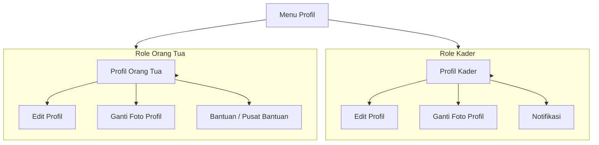
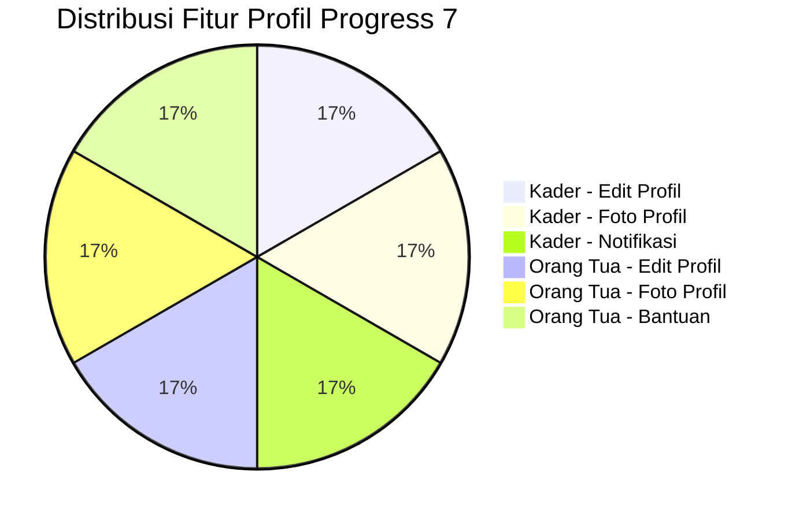

# LAPORAN PROGRESS 7

BAB I
PENDAHULUAN

1.1 Latar Belakang
Pengembangan aplikasi Posco pada sisi mobile bertujuan menyediakan antarmuka yang jelas, konsisten, dan mudah digunakan oleh dua role utama, yaitu kader dan orang tua. Setelah fitur inti seperti dashboard, data anak, jadwal, riwayat, dan input pemeriksaan dibangun pada progress sebelumnya, tahap berikutnya difokuskan pada penyempurnaan halaman profil. Fokus ini penting karena menu profil menjadi pusat pengelolaan identitas akun, foto pengguna, akses notifikasi, dan akses bantuan yang sering dibutuhkan dalam penggunaan harian.

Progress ke-7 ini berfokus pada pembaruan bagian profil untuk role kader dan role orang tua. Pada role kader, pembaruan meliputi edit profil, ganti foto profil, dan notifikasi. Pada role orang tua, pembaruan meliputi edit profil, ganti foto profil, serta bantuan atau pusat bantuan. Seluruh pembaruan ini dirancang agar pengalaman pengguna lebih lengkap, lebih rapi, dan lebih mudah dipahami oleh masing-masing role.

Selain peningkatan fungsi, progress ini juga memperhatikan alur navigasi dan konsistensi visual. Pengguna dapat membuka halaman profil, mengubah data akun, mengganti foto, melihat notifikasi, atau membuka bantuan tanpa berpindah keluar dari konteks aplikasi. Dengan begitu, aplikasi menjadi lebih siap digunakan sebagai sarana informasi dan pemantauan kesehatan anak.

Secara lebih spesifik, pembaruan pada bagian profil juga menjadi penutup dari rangkaian penyusunan frontend mobile sebelum aplikasi diarahkan ke tahap integrasi data yang lebih stabil. Hal ini penting karena profil bukan hanya sekadar halaman identitas pengguna, tetapi juga titik interaksi yang sering dibuka untuk mengelola akun, memperbarui informasi pribadi, dan mengakses fitur pendukung. Jika halaman profil ditata dengan baik, maka keseluruhan kesan aplikasi akan terasa lebih matang dan lebih profesional.

Pada progress ini, perhatian diberikan pada pengalaman penggunaan yang sederhana namun tetap informatif. Kader tetap membutuhkan akses ke notifikasi yang berkaitan dengan aktivitas lapangan, sedangkan orang tua membutuhkan akses yang ringkas ke bantuan dan pengaturan data keluarga. Karena itu, penyusunan fitur tidak hanya menambah tombol atau halaman baru, tetapi juga memastikan bahwa setiap komponen benar-benar mendukung kebutuhan pengguna masing-masing.

1.1.1 Konteks Operasional Kader dan Orang Tua
Kader membutuhkan menu profil yang mendukung pengelolaan akun dan akses informasi cepat seperti notifikasi kegiatan. Orang tua membutuhkan menu profil yang lebih sederhana, tetapi tetap lengkap untuk mengubah data pribadi, mengganti foto profil, dan mencari bantuan jika mengalami kendala penggunaan aplikasi. Karena kebutuhan kedua role berbeda, struktur profil dibuat dengan pendekatan yang sesuai dengan peran masing-masing.

1.1.2 Permasalahan yang Diatasi
Pada tahap awal, menu profil masih terbatas pada tampilan dasar. Masalah yang muncul adalah belum tersedianya alur pengelolaan profil yang utuh, belum adanya mekanisme ganti foto profil, serta belum tersedianya halaman pendukung seperti notifikasi dan bantuan. Progress ini mengatasi hal tersebut dengan menambahkan fitur-fitur yang relevan dan membuat alur antarhalaman lebih lengkap.

1.1.3 Arah Pengembangan Role Profil
Arah pengembangan pada progress ini menekankan kemudahan pemakaian, kejelasan menu, dan konsistensi data antarhalaman. Dengan pendekatan ini, role kader dan orang tua tetap memiliki identitas antarmuka yang berbeda, tetapi tetap mengikuti gaya visual yang sama agar aplikasi terasa satu kesatuan.

1.2 Tujuan Progress
Tujuan utama progress ini adalah menyempurnakan halaman profil pada role kader dan orang tua agar masing-masing role dapat mengelola akun dan informasi pendukung secara lebih lengkap. Tujuan tersebut dijabarkan menjadi beberapa poin:

1) Menambahkan fitur edit profil pada role kader.
2) Menambahkan fitur ganti foto profil pada role kader.
3) Menambahkan halaman notifikasi pada role kader.
4) Menambahkan fitur edit profil pada role orang tua.
5) Menambahkan fitur ganti foto profil pada role orang tua.
6) Menambahkan halaman bantuan atau pusat bantuan pada role orang tua.
7) Menjaga konsistensi tampilan dan navigasi antarhalaman profil.

Tujuan-tujuan tersebut disusun agar halaman profil tidak berdiri sebagai elemen pelengkap semata, melainkan sebagai bagian aktif dari alur penggunaan aplikasi. Dalam praktiknya, pengguna sering membuka profil untuk melihat identitas akun, mengganti foto, dan memeriksa informasi pendukung. Oleh sebab itu, penyempurnaan profil memberi dampak langsung pada kenyamanan penggunaan sehari-hari.

1.2.1 Target Output
Target output progress ini adalah halaman profil yang lebih lengkap untuk kedua role, dengan komponen edit data, foto profil, notifikasi, dan bantuan yang dapat diakses secara langsung dari menu profil.

1.2.2 Indikator Keberhasilan
Indikator keberhasilan progress ke-7 meliputi:

1) Halaman profil kader menampilkan aksi edit profil, ganti foto, dan notifikasi.
2) Halaman profil orang tua menampilkan aksi edit profil, ganti foto, dan bantuan.
3) Data profil dapat diperbarui melalui alur navigasi yang konsisten.
4) Foto profil dapat diganti dari galeri atau kamera.
5) Navigasi menuju notifikasi dan bantuan berjalan lancar.
6) Tampilan profil tetap rapi dan mudah dibaca pada kedua role.

1.3 Ruang Lingkup
Ruang lingkup progress ini mencakup seluruh pembaruan pada bagian profil untuk role kader dan orang tua. Fokus pekerjaan meliputi:

1) Profil kader sebagai pusat pengelolaan akun.
2) Edit profil kader, termasuk data identitas dan kontak.
3) Ganti foto profil kader.
4) Notifikasi kader sebagai halaman ringkasan informasi terbaru.
5) Profil orang tua sebagai pusat pengelolaan akun keluarga.
6) Edit profil orang tua, termasuk data pribadi dan data keluarga.
7) Ganti foto profil orang tua.
8) Bantuan atau pusat bantuan untuk orang tua.

Progress ini tetap berbasis frontend dengan data dummy dan navigasi lokal. Integrasi backend dan sinkronisasi data nyata akan dilakukan pada tahap berikutnya.

Secara ruang lingkup, progress ini juga menutup celah antara fitur utama dan fitur pendukung. Sebelumnya, halaman profil sudah tersedia namun belum memberikan pengalaman yang benar-benar lengkap. Dengan pembaruan ini, pengguna tidak hanya melihat data statis, tetapi juga bisa berinteraksi dengan fitur yang mendekati skenario penggunaan riil.

1.3.1 Batasan Teknis
Karena fokus berada pada frontend, fitur profil masih mengandalkan data lokal dan hasil pengembalian dari halaman edit. Belum ada integrasi API untuk menyimpan perubahan ke server, sehingga pembaruan masih bersifat tampilan dan navigasi aplikasi.

1.3.2 Asumsi Dasar
Diasumsikan bahwa pengguna membutuhkan alur profil yang sederhana, mudah dipahami, dan tidak membingungkan. Untuk itu, label tombol, susunan kartu, dan warna visual dibuat seragam dengan tema aplikasi Posco.

1.4 Manfaat Kegiatan
Manfaat progress ini mencakup sisi pengguna, tim pengembang, dan kebutuhan dokumentasi. Untuk pengguna, fitur profil menjadi lebih lengkap dan praktis. Untuk pengembang, struktur menu profil menjadi lebih siap untuk pengembangan lanjutan. Untuk dokumentasi, progress ini memberikan bukti bahwa aplikasi sudah memiliki pengelolaan profil yang lebih matang.

Manfaat tersebut dapat dirinci sebagai berikut:

1) Kader dapat memperbarui profil dan melihat notifikasi tanpa harus keluar dari aplikasi.
2) Orang tua dapat memperbarui data pribadi dan foto profil dengan mudah.
3) Pengguna dapat mencari bantuan melalui pusat bantuan yang tersedia.
4) Aplikasi terlihat lebih lengkap dan siap digunakan dalam demo internal.
5) Dokumentasi progress menjadi lebih kuat karena mencakup fitur profil yang penting.

Selain manfaat langsung tersebut, pembaruan profil juga membantu menjaga kesinambungan desain antarfungsi. Ketika halaman profil, edit profil, notifikasi, dan bantuan memiliki pola visual yang konsisten, pengguna tidak perlu menyesuaikan diri ulang di setiap halaman. Ini mengurangi beban kognitif dan membuat aplikasi terasa lebih stabil dari sisi pengalaman pengguna.

1.4.1 Manfaat Teknis
Progress ini menghasilkan alur navigasi profil yang lebih rapi dan terstruktur. Dengan pemisahan halaman edit, notifikasi, dan bantuan, pengembangan fitur lanjutan dapat dilakukan lebih mudah.

1.4.2 Manfaat Organisasi
Hasil progress ini menunjukkan bahwa aplikasi mulai mendekati pengalaman penggunaan yang lengkap. Hal ini penting untuk presentasi ke tim dan untuk pembuktian capaian pengembangan.

1.5 Sistematika Laporan
Laporan ini disusun dengan struktur: Bab I Pendahuluan, Bab II Progress Pengembangan, Bab III Detail Fitur, Bab IV Rencana Selanjutnya, Bab V Penutup, dan Lampiran.

1.5.1 Gaya Penulisan
Laporan ditulis secara naratif-deskriptif dengan subbab rinci untuk menjelaskan pembaruan fitur profil pada role kader dan orang tua.

1.5.2 Petunjuk Pembacaan
Pembaca dianjurkan mengikuti alur bab secara berurutan agar memahami konteks, implementasi, hasil, dan rencana tindak lanjut dengan lebih mudah.

BAB II
PROGRESS PENGEMBANGAN

2.1 Deskripsi Kegiatan
Progress ke-7 dilakukan dengan fokus pada penyempurnaan fitur profil untuk role kader dan orang tua. Pekerjaan dimulai dari halaman profil kader yang memuat identitas pengguna, kartu profil, edit profil, notifikasi, dan tombol keluar akun. Setelah itu, halaman edit profil kader dikembangkan agar pengguna dapat mengganti data akun sekaligus mengganti foto profil melalui galeri atau kamera.

Tahap berikutnya adalah penyempurnaan notifikasi untuk kader. Halaman notifikasi dirancang sebagai ringkasan informasi terbaru, seperti agenda, pengingat input, dan pengingat profil. Setelah itu, pembaruan dilanjutkan ke role orang tua dengan halaman profil yang memuat identitas akun, edit profil, ganti foto profil, dan pusat bantuan. Dengan demikian, menu profil pada kedua role menjadi lebih lengkap dan bermanfaat.

Selama pengembangan, dilakukan penyesuaian visual agar kartu informasi tetap konsisten dengan tema aplikasi. Penggunaan warna hijau toska, latar terang, dan kartu putih dipertahankan agar komponen terlihat jelas dan mudah dibaca. Navigasi antarhalaman juga diuji agar tombol edit, notifikasi, dan bantuan dapat diakses tanpa hambatan.

Pada sisi implementasi, pembaruan ini tidak hanya menambah halaman baru, tetapi juga memperbaiki alur pertukaran data antarhalaman. Saat pengguna menyimpan hasil edit profil, data lama harus diganti oleh nilai terbaru agar tampilan yang kembali ke halaman profil langsung mencerminkan perubahan tersebut. Pola ini membuat aplikasi terasa responsif terhadap interaksi pengguna, meskipun masih berada pada tahap frontend.

Selain itu, pengembangan progress ini juga mempertimbangkan hierarki informasi. Informasi yang paling sering dibutuhkan, seperti nama pengguna dan foto profil, ditempatkan di bagian atas. Menu aksi yang lebih spesifik, seperti edit profil, notifikasi, dan bantuan, ditata di bagian bawah dalam bentuk kartu aksi agar mudah ditemukan. Susunan seperti ini membantu pengguna memahami fungsi halaman tanpa harus membaca terlalu banyak teks.

2.1.1 Pembaruan Profil Kader
Halaman profil kader dibuat sebagai pusat pengelolaan akun kader. Pada halaman ini ditampilkan nama, email, foto profil, menu edit profil, notifikasi, dan tombol keluar. Struktur kartu dibuat sederhana agar pengguna dapat langsung menemukan fungsi yang dibutuhkan.

Secara tampilan, halaman profil kader dirancang agar informatif tetapi tetap ringan. Informasi identitas diletakkan pada kartu utama, sedangkan menu tindakan dipisahkan agar tidak tercampur dengan data profil. Pendekatan ini berguna untuk menjaga keterbacaan dan menghindari kesan penuh pada layar mobile.

2.1.2 Fitur Edit Profil Kader
Halaman edit profil kader memungkinkan pengguna memperbarui data akun seperti nama, NIK, email, nomor telepon, SIK, kategori penugasan, serta informasi lain yang relevan. Hasil perubahan dikirim kembali ke halaman profil utama melalui navigasi pop-up result, sehingga data yang tampil pada profil dapat langsung diperbarui.

Fitur edit profil ini penting karena data kader bisa berubah seiring waktu, misalnya ketika ada pergantian penugasan, perubahan nomor kontak, atau pembaruan data administrasi. Dengan adanya form edit, pengguna tidak perlu menghapus akun atau membuka halaman lain untuk menyesuaikan data dasar. Semua perubahan dapat dilakukan dalam satu alur yang ringkas.

2.1.3 Fitur Ganti Foto Profil Kader
Fitur ganti foto profil kader dibuat menggunakan mekanisme pemilihan gambar dari galeri atau kamera. Foto yang dipilih ditampilkan pada avatar profil sehingga pengguna bisa melihat perubahan secara langsung. Fitur ini memperkuat personalisasi akun dan membuat profil lebih mudah dikenali.

2.1.4 Fitur Notifikasi Kader
Halaman notifikasi kader menampilkan ringkasan informasi terbaru yang berkaitan dengan tugas kader. Isi notifikasi dirancang informatif, misalnya agenda posyandu, pengingat input timbang, dan pengingat untuk melengkapi profil. Dengan adanya halaman ini, kader dapat memantau informasi penting dengan cepat.

Notifikasi pada role kader berfungsi sebagai pengingat operasional yang membantu pekerjaan lapangan. Informasi seperti jadwal kegiatan, status input, atau pengingat profil tidak harus dicari satu per satu karena sudah dikumpulkan dalam satu halaman. Ini membuat alur kerja kader lebih efisien dan mengurangi risiko terlambat memperbarui data.

2.1.5 Pembaruan Profil Orang Tua
Halaman profil orang tua dibuat sebagai pusat informasi akun keluarga. Pada halaman ini ditampilkan nama, email, foto profil, data anak, menu edit profil, pusat bantuan, dan tombol keluar akun. Layout dibuat sederhana agar sesuai dengan kebutuhan orang tua yang membutuhkan akses cepat dan mudah dipahami.

Karakter halaman profil orang tua dibuat lebih ramah dan tidak terlalu padat, karena target penggunanya adalah pengguna umum yang membutuhkan informasi penting dengan cepat. Data anak tetap ditampilkan agar orang tua dapat langsung mengenali konteks akun yang sedang digunakan. Sementara itu, pusat bantuan disediakan agar pengguna memiliki tempat bertanya ketika menemukan istilah atau alur yang kurang dipahami.

2.1.6 Fitur Edit Profil Orang Tua
Halaman edit profil orang tua memungkinkan perubahan data seperti nama lengkap, NIK, email, password, nomor telepon, nama anak, tanggal lahir anak, alamat, dan pilihan posyandu. Pendekatan ini membuat profil orang tua lebih fleksibel dan dapat disesuaikan dengan data keluarga yang sebenarnya.

Pembaruan data orang tua juga berperan penting dalam menjaga sinkronisasi informasi keluarga. Dalam praktik penggunaan, data kontak atau data anak bisa berubah, sehingga form edit harus cukup fleksibel untuk menyesuaikan kondisi terbaru. Dengan form yang lengkap, pengguna dapat memperbarui informasi tanpa harus melakukan proses yang berulang.

2.1.7 Fitur Ganti Foto Profil Orang Tua
Seperti pada role kader, orang tua juga dapat mengganti foto profil melalui galeri atau kamera. Perubahan foto ditampilkan langsung pada tampilan profil agar pengguna mengetahui hasil pembaruan secara visual.

2.1.8 Fitur Bantuan Orang Tua
Menu bantuan pada role orang tua mengarah ke pusat bantuan berisi FAQ dan informasi umum penggunaan aplikasi. Fitur ini membantu pengguna memahami cara menggunakan fitur dasar, membaca status gizi, melihat riwayat pemeriksaan, dan menghubungi dukungan jika diperlukan.

Kehadiran pusat bantuan juga penting untuk menurunkan hambatan penggunaan aplikasi. Tidak semua pengguna langsung memahami istilah terkait kesehatan anak atau navigasi menu yang tersedia. Karena itu, FAQ yang disusun dalam bahasa sederhana membantu orang tua merasa lebih percaya diri ketika menggunakan aplikasi.

Diagram 1. Alur Pembaruan Fitur Profil
Letakkan diagram ini setelah subbab 2.1.8 untuk menggambarkan alur fitur profil.

2.2 Hasil Kegiatan
Hasil utama progress ke-7 adalah tersedianya pembaruan fitur profil yang lebih lengkap pada role kader dan orang tua. Pengguna kini dapat mengelola identitas akun, mengganti foto profil, membuka notifikasi, dan mengakses bantuan dengan alur navigasi yang lebih jelas.

Secara keseluruhan, hasil yang dicapai pada progress ini memperkuat sisi usability aplikasi. Pengguna dapat menyelesaikan tugas yang berkaitan dengan profil tanpa kebingungan, dan halaman-halaman pendukung memiliki hubungan yang lebih logis dengan menu utama. Ini menjadi indikator bahwa aplikasi tidak hanya berfungsi secara visual, tetapi juga semakin nyaman dipakai.

2.2.1 Profil Kader Lebih Lengkap
Halaman profil kader kini memuat menu edit profil, notifikasi, dan keluar akun dalam tampilan yang lebih rapi.

2.2.2 Profil Orang Tua Lebih Lengkap
Halaman profil orang tua kini memuat menu edit profil, pusat bantuan, dan keluar akun sehingga kebutuhan dasar pengguna terpenuhi.

2.2.3 Ganti Foto Profil Berfungsi
Fitur pemilihan foto dari galeri atau kamera sudah tersedia pada halaman edit profil untuk kedua role.

2.2.4 Navigasi Menu Pendukung Berjalan
Tombol menuju notifikasi kader dan pusat bantuan orang tua dapat diakses langsung dari halaman profil.

2.2.5 Tampilan Tetap Konsisten
Walaupun fungsi bertambah, gaya visual tetap konsisten dengan tema aplikasi Posco secara keseluruhan.

2.3 Ringkasan Progress Minggu Ini
Ringkasan progress minggu ini mencakup:

1) Penyempurnaan halaman profil kader.
2) Penambahan edit profil dan ganti foto profil kader.
3) Pembuatan halaman notifikasi kader.
4) Penyempurnaan halaman profil orang tua.
5) Penambahan edit profil dan ganti foto profil orang tua.
6) Penambahan pusat bantuan untuk orang tua.

2.3.1 Ringkasan Per Role
1) Role kader: profil, edit profil, ganti foto profil, notifikasi, dan logout.
2) Role orang tua: profil, edit profil, ganti foto profil, bantuan, dan logout.

2.4 Kendala dan Solusi
Selama progress ke-7, terdapat beberapa kendala teknis dan solusi yang diterapkan:

2.4.1 Kendala Perubahan Data Profil
Masalah: data yang diubah pada halaman edit harus dikirim kembali ke halaman profil utama.
Solusi: menggunakan hasil return dari navigasi agar nilai nama, email, dan foto profil dapat diperbarui pada state halaman profil.

2.4.2 Kendala Pemilihan Foto
Masalah: foto profil perlu mendukung galeri dan kamera agar lebih fleksibel.
Solusi: memanfaatkan image picker dengan pilihan sumber gambar yang berbeda dan menampilkan hasilnya pada avatar.

2.4.3 Kendala Konsistensi Tampilan
Masalah: halaman profil dan halaman pendukung berpotensi terlihat berbeda satu sama lain.
Solusi: mempertahankan warna utama, kartu putih, radius sudut yang seragam, dan tipografi yang konsisten.

2.4.4 Kendala Navigasi Menu Pendukung
Masalah: pengguna harus dapat membuka notifikasi dan bantuan dengan cepat dari profil.
Solusi: menambahkan action card langsung pada halaman profil agar akses ke fitur pendukung lebih jelas.

2.4.5 Kendala Kejelasan Informasi
Masalah: profil orang tua harus tetap sederhana walaupun memiliki data keluarga yang lebih banyak.
Solusi: menyusun ulang kartu profil dan form edit agar informasi tampil ringkas, terarah, dan tidak membingungkan.

Diagram 2. Distribusi Fitur Profil
Letakkan diagram ini setelah subbab 2.4.5.

BAB III
DETAIL FITUR

3.1 Profil Kader
Halaman profil kader menjadi pusat pengelolaan identitas pengguna pada role kader. Komponen yang ditampilkan meliputi nama, email, avatar, menu edit profil, notifikasi, dan tombol keluar akun.

3.1.1 Edit Profil Kader
Edit profil kader berisi form untuk memperbarui identitas dan data pendukung. Hasil perubahan dikembalikan ke halaman profil utama agar tampilan tetap sinkron.

3.1.2 Ganti Foto Profil Kader
Foto profil kader dapat diganti melalui galeri atau kamera. Foto baru ditampilkan pada avatar agar pengguna langsung melihat hasil pembaruan.

3.1.3 Notifikasi Kader
Halaman notifikasi menyajikan ringkasan informasi terbaru yang berkaitan dengan aktivitas kader, seperti agenda, pengingat input, dan pengingat profil.

3.2 Profil Orang Tua
Halaman profil orang tua menjadi pusat pengelolaan data akun dan data keluarga. Komponen yang ditampilkan meliputi nama, email, avatar, menu edit profil, pusat bantuan, dan tombol keluar akun.

3.2.1 Edit Profil Orang Tua
Edit profil orang tua menyediakan form untuk memperbarui data pribadi dan data anak agar profil tetap sesuai dengan kondisi pengguna.

3.2.2 Ganti Foto Profil Orang Tua
Fitur ganti foto profil orang tua memiliki mekanisme yang sama seperti pada kader, yaitu memilih foto dari galeri atau kamera.

3.2.3 Bantuan Orang Tua
Pusat bantuan berisi FAQ dan informasi umum yang membantu orang tua memahami cara menggunakan aplikasi dan menemukan jawaban atas pertanyaan dasar.

3.3 Struktur Implementasi
Secara teknis, pembaruan profil dibangun dengan pendekatan stateful pada halaman profil, form input pada halaman edit, pemilihan gambar menggunakan image picker, dan navigasi antarhalaman menggunakan MaterialPageRoute.

Pendekatan ini dipilih karena sederhana, mudah dipahami, dan cukup efektif untuk kebutuhan current stage pengembangan. Halaman profil memegang state lokal agar hasil edit bisa langsung terlihat, sedangkan halaman edit berperan sebagai tempat mengumpulkan data baru. Image picker dipakai supaya pengguna memiliki pilihan sumber foto, dan MaterialPageRoute membantu menjaga alur perpindahan halaman tetap natural.

3.3.1 Alur Data Profil
1) Pengguna membuka halaman profil.
2) Pengguna memilih edit profil atau menu pendukung.
3) Pada halaman edit, data diperbarui atau foto diganti.
4) Hasil perubahan dikirim kembali ke halaman profil.
5) Tampilan profil diperbarui sesuai data terbaru.

BAB IV
RENCANA SELANJUTNYA

4.1 Rencana Kegiatan
Rencana kegiatan selanjutnya meliputi:

1) Menyempurnakan penyimpanan data profil agar tersimpan lebih permanen.
2) Menghubungkan perubahan profil ke backend atau API ketika tersedia.
3) Menambahkan validasi input yang lebih ketat pada form edit profil.
4) Menyiapkan notifikasi yang lebih dinamis dan berbasis data nyata.
5) Menyempurnakan pusat bantuan dengan informasi yang lebih lengkap.

4.2 Strategi Pelaksanaan
Strategi pelaksanaan meliputi iterasi cepat, pengujian navigasi antarhalaman, dan penyelarasan visual agar seluruh fitur profil tetap konsisten dengan desain aplikasi.

4.2.1 Strategi Uji Coba
Setiap pembaruan diuji melalui navigasi langsung untuk memastikan data yang diubah benar-benar kembali ke halaman profil.

4.2.2 Strategi Dokumentasi
Dokumentasi dilakukan dengan mencatat fitur yang ditambahkan, alur pengguna, dan referensi file kode yang digunakan pada laporan berikutnya.

Dokumentasi juga membantu saat dilakukan peninjauan ulang terhadap progress yang telah selesai. Dengan catatan yang jelas, tim dapat membandingkan fitur lama dan fitur baru tanpa harus menelusuri seluruh kode dari awal.

BAB V
PENUTUP

5.1 Kesimpulan
Progress ke-7 berhasil menyempurnakan bagian profil pada role kader dan orang tua. Role kader kini memiliki fitur edit profil, ganti foto profil, dan notifikasi. Role orang tua kini memiliki fitur edit profil, ganti foto profil, dan bantuan. Dengan pembaruan ini, aplikasi Posco menjadi lebih lengkap dari sisi pengelolaan akun dan dukungan pengguna.

Jika dilihat secara keseluruhan, progress ini menegaskan bahwa aplikasi sudah bergerak dari sekadar menampilkan fitur dasar menuju pengalaman penggunaan yang lebih utuh. Menu profil kini tidak lagi bersifat pasif, melainkan menjadi pintu masuk untuk mengelola identitas, menerima informasi penting, dan memperoleh bantuan ketika dibutuhkan. Dengan demikian, progress ke-7 menjadi langkah penting sebelum aplikasi diarahkan ke tahap integrasi data yang lebih serius.

5.2 Saran
Disarankan untuk melanjutkan pengembangan menuju penyimpanan data yang permanen dan integrasi backend agar perubahan profil tidak hanya berlaku di tampilan lokal. Selain itu, halaman notifikasi dan bantuan dapat terus dikembangkan agar lebih informatif dan lebih interaktif.

LAMPIRAN
1. Screenshot/Dokumentasi Hasil Kerja
- Profil Kader
- Edit Profil Kader
- Ganti Foto Profil Kader
- Notifikasi Kader
- Profil Orang Tua
- Edit Profil Orang Tua
- Ganti Foto Profil Orang Tua
- Pusat Bantuan Orang Tua

2. Referensi Laporan Sebelumnya
- Laporan_Progress_5.md sebagai referensi struktur awal pengembangan mobile.
- Laporan_Progress_Orang_Tua.md sebagai referensi penyusunan fitur role orang tua.
- LAPORAN_PROGRESS_APLIKASI_WEB.md sebagai referensi gaya penulisan dan kelengkapan bab.

3. Referensi Kode Terkait
- lib/features/kader/profile_screen.dart
- lib/features/kader/edit_profile_screen.dart
- lib/features/kader/notification_screen.dart
- lib/features/orang_tua/orang_tua_profile_screen.dart
- lib/features/orang_tua/edit_profile_screen.dart
- lib/features/orang_tua/help_center_screen.dart
- lib/features/orang_tua/notification_screen.dart

4. Catatan Penempatan Diagram
- Diagram 1 setelah subbab 2.1.8.
- Diagram 2 setelah subbab 2.4.5.